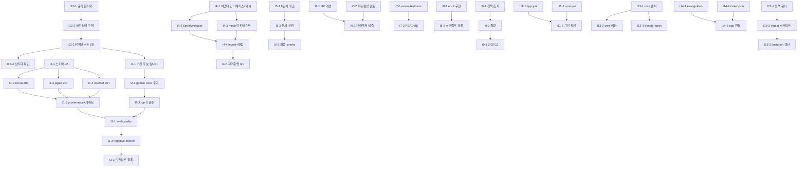

# ReleaseCheck 작업 그래프 (Task Graph)

버전: v2 (2026-08-14). 이슈 #1–#15를 실행 단위(서브태스크)로 분해한 마스터 DAG.
루프 실행 시 이 문서의 **배치(Wave)** 순서와 **엣지**를 따라가고, 각 서브태스크 수락 후 이슈 본문의 체크리스트를 갱신한다.

## 그래프



## Lane (병렬 실행 그룹)

| Lane | 이슈 | 담당 에이전트 관점 | 성격 |
|---|---|---|---|
| A core | #12, #13, #14 | `task` (Rust) | 매칭/벤치/워커 |
| B data | #1, #2 | `task` | 셋 작성·검증 (정확도 중시) |
| C pipeline | #4, #3 | `task` | 어댑터/게이트 |
| D surface | #5, #6, #7, #8 | `designer`(#6), `task` | 문서/UI/SDK/CLI |
| E decision | #9 | `dorothy` 관점 조사 → 사용자 결정 | 정책 |
| F infra | #11, #15 | `task` | CI/인제스트 |

lane 간 병렬 실행 가능. 의존 엣지(I12→I2→I3, I1→I3)만 순서 강제.

## 승인 Gate (merge/deploy/credential — noah 또는 사용자 승인 필수)

- **G1 (I4-5)**: Spotify Client Credentials 실제 발급·설정 — 자격증명은 subagent가 아닌 사용자 승인 후 `.env`에 기록.
- **G2 (I9-3)**: SoundCloud 자격증명 도입 결정 시 — 정책 문서 + 사용자 승인 후 반영.
- **G0**: 모든 커밋/푸시는 이슈별 수락 기준 통과 후 (루프 자체가 커밋).

## 배치 (Wave) — 루프 실행 순서

| Wave | 서브태스크 | 비고 |
|---|---|---|
| 1 | I12 전체, I1-1, I4-1..3, I5, I6, I7, I8, I9-1, I11, I13, I14-1..2, I15 | 전부 병렬 가능 (lane별) |
| 2 | I1-2..4 (korea/japan/internet 병렬), I2-1 (I12-3 후), I4-4, I9-2, I13-2..3 | Wave1 산출물 소비 |
| 3 | I1-5, I2-2..3, I3-1..3, I14-3, I4-5(G1), I9-3(G2) | 병합·승인 지점 |
| 4 | 통합 검증: 전 게이트 (bun check/test/eval 3종/validate/cargo test), docs 갱신 | 릴리즈 컷 |

## 서브태스크 스펙

### I12 버전 마커 규칙 — Lane A (core)

- [ ] **I12-1 규칙 문서화** — `core/ROADMAP.md` open question 종결: Live/Demo/Instrumental/SpedUp 불일치 → Rejected (hard), Remix/Remaster 불일치 → PossibleMatch + 감점 (weighted).
- [ ] **I12-2 구현** — `core/crates/rc-core/src/lib.rs` `score_candidate`/`decide_status`: hard 마커 set 교집합 없음 → `Rejected` (evidence에 version 필드). → 테스트: `cargo test --workspace` (기존 11건 회귀)
- [ ] **I12-3 단위 테스트 5건** — tests 모듈에: live-demo vs original → Rejected / remix vs original → PossibleMatch / remaster vs original → PossibleMatch / 동일 마커 → Matched / 마커 없음 동일 → Matched. → 테스트: `cargo test --workspace`
- [ ] **I12-4 브리지** — `bun run eval:core` (Rejected/PossibleMatch 전달 확인).

### I1 평가 셋 확장 — Lane B (data)

- [ ] **I1-1 스키마 v2** — `data/evaluation-set.json`: `releasecheck.evaluation-set.v2`, case에 `scene`+`groundTruth` 필드. 기존 3건 마이그레이션. → 테스트: `bun test`, `eval:demo`, `eval:verified`
- [ ] **I1-2 korea 20+** — verified 5건 기반 + 지저분한 변형(이름 변형/feat/리믹스 혼동/동명) + negative. 케이스마다 `bun run eval:demo`로 expectedTop3Id 확인.
- [ ] **I1-3 japan 20+** — 위와 동일.
- [ ] **I1-4 internet 20+** — 위와 동일.
- [ ] **I1-5 마무리** — provenance 해시 갱신 → `bun run validate:provenance` + 전체 게이트.

### I2 골든 셋 버전 — Lane B (data, I12-3 후)

- [ ] **I2-1 버전 후보** — 실URL 검증 후 `apps/api/src/verified-index.ts`에 3–5건 추가 (remix/live/demo/remaster, ambiguity 마커). → 테스트: `bun test`, `eval:demo`
- [ ] **I2-2 golden case** — `data/golden-set.json`: versionDistinction/queries/acceptableTop3Ids/platforms + negativeCases 확장.
- [ ] **I2-3 검증** — 골든 쿼리 top-3 확인 + provenance 갱신 → `bun run validate:provenance`.

### I3 실측 게이트 — Lane C (I1-5, I2-3 후)

- [ ] **I3-1 eval-quality** — `scripts/eval-quality.ts` (runGate): 골든 100% / 평가 top-3 ≥90% / FP ≤5% / unknown ≤10%, measurements JSON. → 테스트: `bun run eval-quality`
- [ ] **I3-2 negative control** — expectNegativeControl (없는 expectedTop3Id → 실패). → 테스트: PASS 확인
- [ ] **I3-3 등록** — `package.json` `eval:quality` + `bun run check`.

### I4 실데이터 ingestion — Lane C (독립, G1 포함)

- [ ] **I4-1 어댑터 인터페이스+캐시** — `adapters.ts` `PlatformAdapter` + `data/cache/platform/{platform}.json` TTL 로직.
- [ ] **I4-2 SpotifyAdapter** — Client Credentials, token 캐시, `liveLookupAllowed: false` 준수.
- [ ] **I4-3 mock 단위테스트** — `tests/platform-adapters.test.ts` (캐시 히트/미스/TTL). → `bun test`
- [ ] **I4-4 ingest+병합** — `scripts/ingest-platform.ts` + `build-index.ts` 실데이터 병합. → `build:index` 후 `eval:demo`, 합성 비율 기록
- [ ] **I4-5 G1 자격증명** — `.env.example` + 실제 설정 (사용자 승인 후).

### I5 데모 시나리오 — Lane D (독립)

- [ ] **I5-1 대조** — docs/demo.md 8단계 실행 대조.
- [ ] **I5-2 보완** — verified 데이터 반영, limitations 갱신.
- [ ] **I5-3 smoke** — `dev:demo` → /health, /search(verified), 웹 렌더.

### I6 웹 폴리싱 — Lane D (designer, 독립)

- [ ] **I6-1 UX 개선** — `client.ts` 근거 접기/상태 배지/verified 표시 (필요 시 `index.ts`에 origin 노출). → `bun run check`
- [ ] **I6-2 자동완성** — prefix 인덱스 검토 (랭킹 불변 확인: `eval:demo`).
- [ ] **I6-3 브라우저 실측** — 검색→후보→근거→unknown 흐름 + 스크린샷.

### I7 SDK 예제 — Lane D (독립)

- [ ] **I7-1 examples/basic.ts** — search→availability→resolve, `dev:api` 기동 후 실행.
- [ ] **I7-2 README** — 실행 방법 + `bun run check`.

### I8 CLI — Lane D (독립)

- [ ] **I8-1 rc-cli** — `scripts/rc-cli.ts`: search/availability/resolve (SDK 재사용). → `dev:api` 기동 후 실행, curl과 동일 필드
- [ ] **I8-2 등록** — package.json `rc:*` 스크립트 + README.

### I9 SoundCloud 정책 — Lane E (decision, G2)

- [ ] **I9-1 조사** — 자격증명 절차/rate limit/요금/약관 문서화.
- [ ] **I9-2 결정** — (a) public_index 유지 (b) 공식 API (c) manual_seed → PRD §8 반영.
- [ ] **I9-3 반영** — `adapters.ts` 정책 갱신 (도입 시 G2 승인 후). → `bun run check`

### I11 CI — Lane F (독립)

- [ ] **I11-1 app.yml** — setup-bun → install → check → test → eval:demo → eval:verified → validate:provenance.
- [ ] **I11-2 core.yml** — rust-toolchain → `cargo test --workspace` (working-directory `core/`).
- [ ] **I11-3 확인** — main 푸시 후 Actions 그린.

### I13 벤치 — Lane A (독립)

- [ ] **I13-1 core 벤치** — `core/crates/rc-core/benches/match_bench.rs` (criterion, 1k 쿼리). → `cargo bench`
- [ ] **I13-2 core 예산** — 매칭 p95 ≤ 10ms 고정 (어서션/문서).
- [ ] **I13-3 bench-report** — `scripts/bench-report.ts` + `docs/benchmark.md` (p50/p95/p99/dataset/query/mode/machine). → `bun run bench:search` 회귀

### I14 rc-worker eval — Lane A (부분 I2 의존)

- [ ] **I14-1 eval-golden** — `rc-worker/src/main.rs` 새 명령: cases → top-3 포함/FP 리포트. → 기존 match-json 회귀
- [ ] **I14-2 index-json** — NormalizedRecord 직렬화 출력.
- [ ] **I14-3 app 연동** — `scripts/eval-golden-core.ts` → 골든 셋 실행. → `bun run eval:core` 회귀

### I15 MB ingest — Lane F (독립)

- [ ] **I15-1 정책 문서** — `docs/musicbrainz-policy.md` (UA/1rps/CC0 whitelist/폴링 금지).
- [ ] **I15-2 ingest 스크립트** — `scripts/ingest-musicbrainz.ts` (mock 단위테스트만, 실호출 금지 — rate limit). 시드 스키마 동일 출력.
- [ ] **I15-3 limitation 갱신** — `validate-provenance` limitation 반영.

## 통합 검증 (Wave 4)

```bash
bun run check
bun test
bun run build:index
bun run eval:demo
bun run eval:verified
bun run eval:quality    # I3 완료 후
bun run validate:provenance
cd core && cargo test --workspace
bun run eval:core
```
